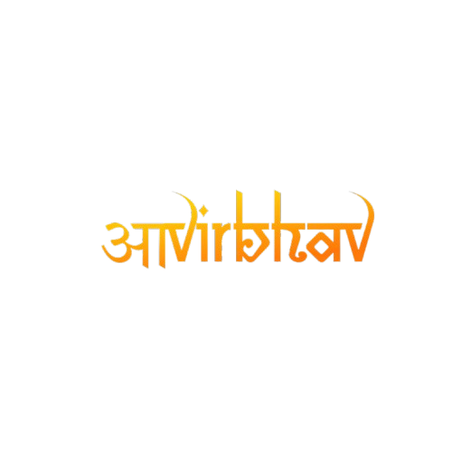
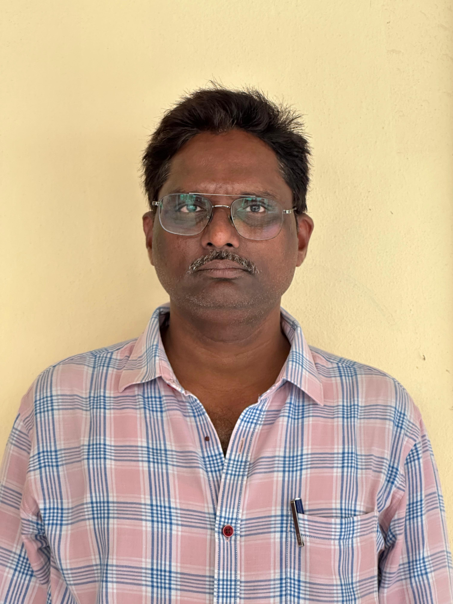

<!DOCTYPE html>
<html lang="en">
<head>
    <meta charset="UTF-8">
    <meta http-equiv="X-UA-Compatible" content="IE=edge">
    <meta name="viewport" content="width=device-width, initial-scale=1.0">
    <title>AVIRBHAV 2024</title>
    <link rel="stylesheet" href="Styles.css">
    <link href="https://fonts.googleapis.com/css2?family=Poppins:wght@300;400;600;700&display=swap" rel="stylesheet">
    <link rel="stylesheet" href="https://cdnjs.cloudflare.com/ajax/libs/font-awesome/6.0.0-beta3/css/all.min.css">
    <link rel="stylesheet" href="https://cdnjs.cloudflare.com/ajax/libs/aos/2.3.4/aos.css">
</head>
<body>
    <header class="header">
        

            

                 
            

            <nav class="navbar">
                <ul class="nav-links">
                   
                    <li><a href="events.html">Events</a></li>
                    <li><a href="schedule.html">Schedule</a></li>
                     <li><a href="winners.html">Winners</a></li>
                    <li><a href="contact.html">Contact Us</a></li>
                   
                </ul>
            </nav>
        

    </header>

    

        
Welcome to Avirbhav-2k24! Our fest dates are September 12-13, 2024. <a href="brochure.jpg" download>Click here to download our brochure</a>

        

    

    <section id="home" class="hero-section" data-aos="fade-in">
        

             <video autoplay muted loop id="background-video">
                <source src="video.mp4" type="video/mp4">
                Your browser does not support the video tag.
            </video> 
            

            

                
                
Join us Avirbhav Events and Register

                

                    <a href="events.html" class="btn">Explore Events</a>
                

            

        

    </section>

    <section id="about" class="about-section" data-aos="fade-up">
        

            <h2>About Avirbhav</h2>
            

                Avirbhav is our annual fest packed with fun, creativity, and excitement! Whether you love tech, art, or games, there’s something for everyone. Show off your skills in our <strong>Technical Events</strong> with coding challenges, hackathons, and tech quizzes. For those who enjoy the arts, our <strong>Non-Technical Events</strong> feature cultural performances, debates, and creative competitions that let you shine. And if you’re here for the thrill, dive into our Games and Fun section with <strong>e-sports</strong>, traditional games, and activities that bring everyone together for a good time. Join us at Avirbhav for a day full of learning, competition, and endless fun—you won’t want to miss it!
            

        

    </section>
   <section class="video-section">
        <h2>Watch Our Video</h2>
        

           <iframe
            width="560"
            height="315"
            src="https://www.youtube.com/embed/TGnHUDlxPFo?si=KejaiTCbc40gcAfA&autoplay=1&loop=1&playlist=TGnHUDlxPFo"
            title="YouTube video player"
            frameborder="0"
            allow="accelerometer; autoplay; clipboard-write; encrypted-media; gyroscope; picture-in-picture; web-share"
            referrerpolicy="strict-origin-when-cross-origin"
            allowfullscreen
          ></iframe>
        

    </section>

    <section id="team" class="team-section" data-aos="fade-up">
        

            <h2>Convener</h2>
            

                

                    
                    <h3>DR.B.RAMA KRISHNA</h3>
                    
Convenor & Head of the AI & ML Department

                    
<i class="fas fa-phone"></i> +91 7989662002

                

                
            

        

    </section>
    <section id="team" class="team-section" data-aos="fade-up">
        

            <h2> Co-Conveners</h2>
            

                
                

                    
                    <h3>DR.G.SUDHAKAR</h3>
                    
Co-Convenor

                    
<i class="fas fa-phone"></i> +91 9705412233

                

                

                    
                    <h3>V.SUBRAMANYAM</h3>
                    
Co-Convenor

                    
<i class="fas fa-phone"></i> +91 9666714277

                

            

        

    </section>

    <footer class="footer">
        

            
@ 2024 AIML Dept | All Rights Reserved

            <ul class="social-media">
           
                <li><a href="https://www.linkedin.com/company/ieee-cis-student-branch-chapter-swarnandhra/posts/?feedView=all"><i class="fab fa-linkedin-in"></i></a></li>
                <li><a href="https://www.instagram.com/avirbhav2k24?igsh=d3BsbmJnbHNoamgx"><i class="fab fa-instagram"></i></a></li>
                <li>
                    <a href="https://www.youtube.com/@Avirbhav_2K24/videos">
                        <i class="fab fa-youtube"></i>
                    </a>
                </li>
            </ul>
        

    </footer>

    
    
</body>
</html>
